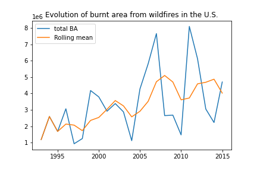
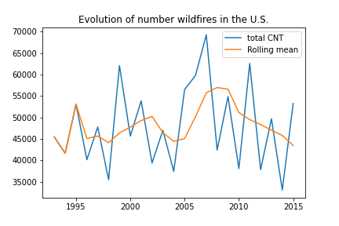

<style>
body {text-align: justify}
body {text-justify: inter-word}
</style>

```{r setup, include=FALSE}
knitr::opts_chunk$set(echo = TRUE)
options(knitr.duplicate.label = "allow")
```

## Introduction

Wildfires are uncontrolled fires that burn in the wildland vegetation, often in rural areas. They are not limited to a particular continent or environment, and burned different kinds of ecosystems for hundreds of millions of years on Earth (@definitionWilfires). The problem of wildfires is at the stake all over the world, along with the topic of climate change and preservation of nature and ecosystems. There has been several major cases of wildfires recently, growing in number and severity: for instance, the California wildfires in 2020 became one of the largest wildfire season in the California history (@californiaWildfire) with several millions of acres burnt (@burntArea). Also, Turkey went through the worst wildfire season of the country in July and August 2021 (@wildfireTurkey), and the 2019-2020 bushfires in Australia (also known as the Black Summer) killed several billions of animals. A lot of them were endangered species, which some were believed to be driven to extinction from this incidence (@wildfireAus). Therefore, a lot of countries aim at minimizing the size and the number of occurrences of wildfires, since they can be the cause of many direct and indirect fatalities in humans (@fatalities), as well as air pollution (@airPollution) and the loss of ecosystems and biodiversity (the case of Black Summer). 

In order to reduce the number and the severity of wildfires, understanding the main factors at the origin of the catastrophy is necessary. The incidences are very often caused accidentally (burning debris, agricultural activities, campfires, smoking), or intentionally (arson, children). Although the latter case can be prevented, human or non-human accidents can always happen and they are hard to predict (@causes). However, we can suspect that there are certain natural conditions that make those accidents easier to happen and to grow them bigger in size. By identifying them, the states can build a strategy to efficiently suppress wildfire once it happens, and get prepared to fight against for locations that are highly possible to catch fire at a certain period of the year. 

In addition, those factors change as the time goes by, and they generate a better or worse conditions for wildfires to happen. For instance, global warming is highly suspected to be one of the main reasons why the wildfires were more recurrent in the recent days (@globalWarming). Countries have been undergoing climate changes, and those unexpected events can be the seed of the recent disasters.

### Research questions
The purpose of this investigation is to give an answer to the following question : 

What are the main factors that affect the propagation of wildfires within the United States ?

An investigation will be conducted and consists in answering these subquestions :

1. How have the number of fires in the United States of America evolved with time from 1993 to 2015?

2. How do the land covers vary over time? 

3. How are fires distributed across the land covers and meteorological factors?


### Approaches
To answer the above questions we will proceed as follows. 
A descriptive and visual approach where interactive plots will be produced  with information on different dimensions: geographically, temporally and by different factors. 
Afterwards, the distribution of land covers will be studied. Also, the analysis of the variation of land covers in the same location will be carried because of the changes that have been noticed in some areas. 
We will then proceed with the analysis of the number of fires. To do so, the analysis of the land covers and meteorological parameters will be conducted. 
After noticing that the correlation between parameters was low, we used subsets and performed a quantile regression. 

## Sources of information / datasets
To perform this analysis, a dataset for the United States from 1993 to 2015 will be used. It contains 563,983 rows with 37 columns. The columns are the following:

* $CNT$ – number of wildfires 
* $BA$ – aggregated burnt area of wildfires in acres 
* $lon$ – longitude coordinate of grid cell center
* $lat$ – latitude coordinate of grid cell center
* $area$ – the proportion of a grid cell that overlaps the continental US (a value in (0,1], which can be smaller than 1 for grid cells on the boundary of the US territory)
* $month$ – month of observation (integer value between 3 and 9)
* $year$ – year of observation (integer value between 1 and 23, with 1 corresponding to year 1993 and 23 to year 2015)
* $lc1$ to $lc18$: area proportion of 18 land cover classes in the grid cell. 
Their denominations as given in the original dataset are as follows:
  * $lc1$: cropland rainfed
  * $lc2$: cropland rainfed herbaceous cover
  * $lc3$: mosaic cropland
  * $lc4$: mosaic natural vegetation
  * $lc5$: tree broadleaved evergreen closed to open
  * $lc6$: tree broadleaved deciduous closed to open
  * $lc7$: tree needleleave evergreen closed to open
  * $lc8$: tree needleleaved deciduous closed to open
  * $lc9$: tree mixed
  * $lc10$: mosaic tree and shrub
  * $lc11$: shrubland
  * $lc12$: grassland
  * $lc13$: sparse vegetation
  * $lc14$: tree cover flooded fresh or brakish water
  * $lc15$: shrub or herbaceous cover flooded
  * $lc16$: urban
  * $lc17$: bare areas
  * $lc18$: water
* $altiMean$, $altiSD$: altitude-related variables given as mean and standard deviation in the grid cell 
* $clim1$ to $clim10$: monthly means of 10 meteorological variables in the grid cell. They present as follows:
  * 10m U-component of wind (the wind speed in Eastern direction) (m/s)
  * 10m V-component of wind (the wind speed in Northern direction) (m/s)
  * Dewpoint temperature (temperature at 2m from ground to which air must be cooled to become saturated with water vapor, such that condensation ensues) (Kelvin)
  * Temperature (at 2m from ground) (Kelvin)
  * Potential evaporation (the amount of evaporation of water that would take place if a sufficient source of water were available) (m)
  * Surface net solar radiation (net flux of shortwave radiation; mostly radiation coming from the sun) (J/m<sup>2</sup>)
  * Surface net thermal radiation (net flux of longwave radiation; mostly radiation emitted by the surface) (J/m<sup>2</sup>)
  * Surface pressure (Pa)
  * Evaporation (of water) (m)
  * Precipitation (m)
  
Please note that the area proportions $lc1$ to $lc18$ do not always sum to exactly 1 for each pixel and month since a few classes with quasi-0 proportion have been removed. 


Since the original data was given under the context of a [prediction competition with the University of Edimburgh](https://www.maths.ed.ac.uk/school-of-mathematics/eva-2021/competitions/data-challenge), there is a 8,000 of missing values in each of the $CNT$ and $BA$ columns. The missing values are not located necessarily in the same lines for the two features. 

````{r, include=FALSE}

library(ggplot2)
library(tidyr)
library(dplyr)
library(corrplot)
library(maps)
library(tidyverse)
library(Hmisc)
library(zoo)
library(hrbrthemes) 
library(pscl)
library('plot.matrix')
library('psych')
library(bookdown)
library(quantreg)
library(latex2exp)
library(cowplot)
library(reshape2)
library(stargazer)
library(knitr)
library(stargazer)
````

```{r,include=FALSE}
tex2markdown <- function(texstring) {
  writeLines(text = texstring,
             con = myfile <- tempfile(fileext = ".tex"))
  texfile <- pandoc(input = myfile, format = "html")
  cat(readLines(texfile), sep = "\n")
  unlink(c(myfile, texfile))}
```

## Exploratory Data Analysis

```{r, include=FALSE}
load("../Data/data_train_DF.RData")
data_withNA = data_train_DF
data<-data_withNA %>% drop_na()
```

When considering only rows without missing values, 452,930 rows remain. 

```{r, results='asis', echo=FALSE}
sum_of_lcs<-rowSums(data[,8:25])
data_to_summarise<-cbind(data[1:2],sum_of_lcs)
stargazer(data_to_summarise, type = "html", 
          summary.stat = c("min", "p25", "median", "p75", "mean", "max"),title="Table (1): Summary of features CNT, BA and the sum of lcs by row")

```


As shown in the Table (1), wildfires remain relatively rare events. More than 75% of the locations considered have less than two fires per month when looking at the feature $CNT$. Same applies for the feature $BA$ representing aggregated burnt area, where the distribution is strongly positively skewed. 

As stated in the data description, the proportions of the 18 land covers don't always add up to one. Looking at Figure \@ref(fig:sum) and in Table (1), we can see that the minimum value for the sum is 0.82. It is also seen from the 1st Quantile value that only 25% of the data has a sum below approx 0.99. We therefore continue with the data considering it is close enough.  


```{=latex}
\begin{table}[ht]
\centering
\begin{tabular}{rll}
  \hline
 &      Sum Lc  \\ 
  \hline
X & Min.   :  0.8222     \\ 
  X.1 & 1st Qu.:  0.9968     \\ 
  X.2 & Median :   0.9990      \\ 
  X.3 & Mean   :  0.9966    \\ 
  X.4 & 3rd Qu.:  0.9998  \\ 
  X.5 & Max.   :1.0000     \\ 
   \hline
\end{tabular}
\end{table}
```

```{r sum, fig.cap="Histogram representing the sum of land covers by row from 1993 to 2015. The histogram is negatively skewed ", echo=FALSE}
histogram(sum_of_lcs, main="",xlab='sum')
```

```{r boxplot, fig.cap="Distribution of land covers from 1993 to 2015", fig.width=7, fig.height=7, echo=FALSE}
stacked_df1 <- stack(data[,8:25])
# Boxplot from the R trees dataset
colnames(stacked_df1)<-c("distribution", "landcover")
boxplot(stacked_df1$distribution ~ stacked_df1$landcover, main="",lwd = 0.4,alpha = 0.3, xlab="percentages", ylab="land covers",outline=FALSE)
#horizontal = TRUE, 
```

In Figure \@ref(fig:boxplot) is displayed the distribution of land covers using Boxplot.
We can see that most of the land cover represent less than 10% of the the location considered, this shows that the area considered are diverse.


Some transformations on the features were made: first the temperature was converted from Kelvin to Celsius. Next, the U-component of wind (the wind speed in Eastern direction) 
and V-component of wind (the wind speed in Northern direction)  were aggregated using the euclidian norm of the vector:
$$W\hspace{-2pt}speed=\sqrt{{W\hspace{-2pt}speed_{East}}^2 + {W\hspace{-2pt}speed_{North}}^2 }$$
with Wspeed the wind speed.

## Visualisation and wildfires over time

In order to do a descriptive analysis of the data and before exploring the different factors, we first plot on the map the number of cases of wildfires (denoted as $CNT$ ) as well as the burnt area (denoted as $BA$ ) from it with respect to time. This was made with the objective of determining which states are the most affected by wildfires and identifying the time when the fires happen the most. 

The given dataset had a list of different coordinates in the United States. To determine which coordinates belong to which state, the python library $\it{reverse\_geocoder}$  ([link](https://github.com/thampiman/reverse-geocoder)) was used. This library gives the closest address given the coordinates. With this, we proceed by extracting the name of the state, added up the numbers and stored in a dictionary for each state. $CNT_i$ or $BA_i$ stand for the values of the dictionary for i a state in the U.S.A . Let us also denote $CNT_k$ or $BA_k$ the value for k a given coordinate.

To better visualize the data, several adjustments have been made. First, the number of incidences and the burnt area were divided by the total area of the states to make a comparison. Then this value was multiplied by $10^5$ (for $CNT$) or $10^4$ (for $BA$) in order to get the number of wildfires/burnt area of the state per $10^4km^2$ or $10^5km^2$ respectively. Also, we realized that the obtained numbers could go from the order of $10^{-2}$ to $10^{3}$. In order to have a reasonable color scale for each state, the log scale was applied. The final numbers for the plots are calculated as follows:

$$Final\_CNT_i=log_2\left(\frac{10^5\left(\sum\limits_{k=coordinate\_0}^{total\_number\_of\_coordinates\_in\_i}CNT_k\right)}{total\_area\_of\_i}+1\right)$$
$$Final\_BA_i=log_2\left(\frac{10^4\left(\sum\limits_{k=coordinate\_0}^{total\_number\_of\_coordinates\_in\_i}BA_k\right)}{total\_area\_of\_i}+1\right)$$
for i a state in the U.S.A .

The numbers close to 0 are trivial, hence 1 is added before taking the log to avoid having meaningless outliers with the scale starting with big negative numbers.

In addition, we plotted the number of incidences/burnt area for each location in red scatter points with a size scale. To adjust the numbers, the log scale was again applied. The numbers were obtained as follows:

$$Local\_CNT_k=4log_2\left(CNT_k+1\right)$$

$$Local\_BA_k=2log_2\left(BA_k+1\right)$$
 
for k a given coordinate of the dataset.

Several interactive maps in python with the chosen scaling methods was made, but due to technical issues (@1), deploying the maps with an external link was not possible. However, running the interactive maps on the file $\it Visualisation\_general.ipynb$  and $\it Visualisation\_specific.ipynb$  on local servers is still possible, provided that the needed libraries are installed. Figures \@ref(fig:overview), \@ref(fig:CNTm), \@ref(fig:BAm), \@ref(fig:CNTy), \@ref(fig:BAy) are animated plots of the interactive map with respect to different time frame, and the mode ($CNT$ or $BA$ )

Figure \@ref(fig:overview) is an overview of one option that can be chosen for the plot. The color scale shows the burnt area for each states, and the circle scatter plot shows the number of incidences for each coordinates. 

```{r overview, fig.cap="Overview of the interactive map, BA in colors and CNT in scatter circles", echo=FALSE}

include_graphics("1.gif")

```

One observable aspect from these plots is that the number of incidences does not always match with the burnt area. For instance, on June 1993, Texas (The state at the very bottom in the middle on the map) had about $10^3$ acres burnt per $10^4km^2$, but as shown on the Figure \@ref(fig:interactive), the number of incidences was not as huge compared to the burnt area seeing the number and the size of red dots in Texas. 

```{r interactive, fig.cap="Plot in 06/1993, BA in colors and CNT in scatter circles", echo=FALSE, out.width="150%"}


```


Figure \@ref(fig:CNTm) displays the mean out of number of cases of all the years at a specific month. One noticeable aspect is that the states at the edge of the country are most likely to have a high number of incidences. We have a phenomenon similar to the "eye of the storm" at the center, and moving around. At the beginning of the spring season, states at the east side are affected the most : but as the time goes by, the "eye of the storm" moves to the east, and finishes by having states at the west being the most affected.

```{r CNTm, fig.cap="Animated map of mean of number of wildfires from 1993 to 2015 at each month", echo=FALSE}


```

Figure \@ref(fig:BAm) is the mean out of burnt area of all the years at a specific month. Compared to Figure \@ref(fig:CNTm), we can recover more or less the same phenomenon with the change being more dramatic. For example, the numbers at Nevada grows from about $6.88$ acres per $10^4km^2$ in March to $5.80.10^3$ acres per $10^4km^2$ in August, compared to the number of cases that grows from $3.02$ to $67.62$  at the same period.  By the end of summer, the impact of wildfires are huge at the west side of the country. In August, almost half of the land has more than $2^8$ acres burnt per $10^4km^2$.

```{r BAm, fig.cap="Animated map of mean of burnt area from 1993 to 2015 at each month", echo=FALSE}


```

Figure \@ref(fig:CNTy) is the mean out of number of cases from March to September at a specific year. One can deduce that the evolution is heterogeneous throughout the years, but excluding year 2015, the "eye of storm" phenomenon is apparent, with Kansas and the states around it being almost untouched, and the states at the edge being the most affected.

```{r CNTy, fig.cap="Animated map of mean of number of wildfires at each year", echo=FALSE}


```

Figure \@ref(fig:BAy) is the mean out of burnt area from March to September at a specific year. First we can recover more or less the same result as the one from Figure \@ref(fig:CNTy), except the fact that the eye moved from Kansas to Illinois. It seems like the severity of wildfires is almost periodic : at year 1997, 2004, 2010, the cases are less severe, but in 2000, 2007, 2012, the cases are way more severe. 

```{r BAy, fig.cap="Animated map of mean of burnt area at each year", echo=FALSE}


```

We can recover the observation of Figure \@ref(fig:BAy), by plotting the total burnt area ($\sum\limits_{i=state\_0}^{all\;the\;states}BA_i$)  with respect to the year. Figure \@ref(fig:BAtot) shows the evolution of the total burnt area in the U.S. from 1993 to 2015. We can observe that the numbers are indeed periodic. In addition, the graph is slightly increasing considering the plot of the rolling mean of window 4, which implies that the incidences are becoming more and more severe by average. Figure \@ref(fig:CNTtot) shows the evolution of total number of wildfires ($\sum\limits_{i=state\_0}^{all\;the\;states}CNT_i$). Observing the rolling mean of the same condition as the total burnt area, the numbers seem to oscillate but do not have a particular increasing or decreasing trend over time. 

```{r BAtot, fig.cap="Total burnt area with respect to time", echo=FALSE, out.width="250%"}



```

```{r CNTtot, fig.cap="Total number of wildfires with respect to time", echo=FALSE, out.width="250%"}



```


## Wildfires and the land cover:
### Correlation between Land covers and Wildfires:
```{r, include=FALSE}
load("../Data/data_train_DF.RData")
data_withNA = data_train_DF
data<-data_withNA %>% drop_na()
```

```{r corr1,fig.cap="Correlation plot for the fires occurences and the different land covers",fig.width=7, fig.height=7,echo=FALSE}
columns_correlation<-c(1,8:25)
corrplot(cor(data[,columns_correlation]), method = "color", addCoef.col="black", tl.cex = 0.8, cl.cex = 0.8,
               number.cex = 0.7, number.digits = 2)

```

The next step is to determine if there is a significant correlation between the different land covers and the appearance of fires. In order to do so, we use a database filtered of missing data. As can be seen in Figure \@ref(fig:corr1), the correlation between the fire and the land cover remains very low. Considering that a correlation is strong when its absolute value exceeds 0.8, there is no strong correlation between the features nor between the features and the apparition of the fires. 

 
We can nonetheless note that, besides being small, the correlation between the apparation of fires  and  cropland rainfed herbaceous cover, mosaic cropland, shrubland, grassland, bare areas and water is negative, while the correlation with mosaic natural vegetation, tree broadleaved evergreen closed to open, tree broadleaved deciduous closed to open, tree needleleave evergreen closed to open, tree needleleaved deciduous closed to open, tree mixed, mosaic tree and shrub, sparse vegetation, tree cover flooded fresh or brakish water, shrub or herbaceous cover flooded and urban areas is positive. 


```{r,include=FALSE}
matrix_cor<-cor(data[,columns_correlation])

track_highly_correlated_columns <- function(matrix,threshold) {
  n<-nrow(matrix)
  m<-ncol(matrix)
  threshold2<- - threshold
  for (i in 1:n) {
    for (j in 1:m){
      if((matrix[i,j]>threshold) | (matrix[i,j]< threshold2)){matrix[i,j]<- TRUE}
      else{matrix[i,j]<- FALSE}
      
    }}
  return(matrix)
}
Highly_Correlated<-track_highly_correlated_columns (matrix_cor,0.8)

plotDat <- reshape::melt(Highly_Correlated)

#and plot
ggplot(plotDat,aes(X1,X2, fill = c( "lightblue","red")[ value + 1 ])) +
  geom_tile() +
  scale_fill_identity() +
  theme_minimal() +
  ggtitle("Highly correlated features are in red, the rest of the feature are in blue:")

```


```{r, include=FALSE}

```
```{r,echo=FALSE}

```

### Land cover over time and location


This section will address the distribution of land covers over time. To do so, the geographical coordinates of Malibu, California has been selected. This area has been heavily impacted by wildfires in recent years. 'In November 2018, the wealthy coastal enclave of Malibu was engulfed by the Woolsey Fire, which spread to over 96,000 acres of land outside of LA and is now 35% contained. At least two people were pronounced dead in Malibu on Friday' (@Malibu). 
In Figure \@ref(fig:loc), we can see the exact location of the studied point on the map of the United States.


```{r, include=FALSE}
filter_year<-function(data,year){
    if(year %in% unique(data$year)){
        data_filtered<-data %>% filter(year == year)
        data_filtered$Date<-as.yearmon(paste(data_filtered$year, data_filtered$month), "%Y %m")
        data_filtered$Date<-as.Date(data_filtered$Date)
        data_filtered<-data_filtered[ , -which(names(data_filtered) %in% c("year","month"))]
        return (data_filtered)}
    else return(data)}

data93<-filter_year(data,1993)

data_all<-data
data_all$Date <- as.yearmon(paste(data_all$year, data_all$month), "%Y %m")
data_all$Date<-as.Date(data_all$Date)
data_all<-data_all[ , -which(names(data_all) %in% c("year","month"))]

lats<-unique(data_all$lat)
lons<-unique(data_all$lon)
lcs<-1:18


min_lon=min(data93$lon)
max_lon=max(data93$lon)
min_lat=min(data93$lat)
max_lat=max(data93$lat)


# from one lon and lat cordinates, it gives you the values of lc you want if exits
# lc goes from 1 to 18
lc_from_place<-function(df, lon_,lat_, lc_)
{
    if (lon_ %in% lons && lat_ %in% lats && lc_ %in% lcs)
    {
        values<- df %>% filter(lat == lat_) %>% filter(lon == lon_)
        col_index<-5+lc_
        values<-values[, c(col_index,36)]
        return(values)
        
    }
    else{warning("wrong indices")}
}

```
 
```{r loc,fig.cap="Location considered in the analysis here is Malibu, CA",echo=FALSE}

        distLat <- 34.3
        distLon <--118.3
        
        if(distLat != 25.25 &&distLat != 49.25) {distLat<-distLat-0.05}
        if(distLon != -124.25 &&distLat != -66.75) {distLon<-distLon+0.05}
        #loc = unique( selection[, c("lon", "lat", "area")] )
        us <- map_data('state')
        
        # Plot areas
        ggplot() + 
            geom_map(aes(map_id=region), fill="white", color="black", size=0.15, map=us, data=us) +
            expand_limits(x = us$long, y = us$lat) +
            geom_point(data=NULL, aes(x=distLon, y=distLat), colour="red", shape=15) +
            scale_size_identity() + 
            theme(panel.border = element_blank(), panel.grid.major = element_blank(),
                  panel.grid.minor = element_blank()) +
            theme(axis.title.x=element_blank(), axis.text.x=element_blank(), axis.ticks.x=element_blank(),
                  axis.title.y=element_blank(), axis.text.y=element_blank(), axis.ticks.y=element_blank(),
                  plot.title = element_text(size=20, hjust=0.5, vjust=2)) + 
            ggtitle('Malibu') + 
            coord_fixed(1.3)
        
        
```


In Figure \@ref(fig:dist), we can see the distribution of the land covers with time. We can see that the proportions are relatively stable and consistent with time. The predominant cover is the $urban area$ with 31% of the surface in 1993 this proportion only increases with time. 


```{r dist,fig.cap="Distribution of land covers across time from 1993 to 2015 in Malibu, CA",echo=FALSE}
        df <- NULL
        max<-0
        indice<-0
        for(lcs_ in 1:18) {
          trial1<-lc_from_place(data_all, distLon, distLat, lcs_)
          if (trial1[1,1]>max){
            max<-trial1[1,1]
            indice<-lcs_}
        if(nrow(trial1)!= 0){
            temp_df <- data.frame(x=trial1[,2], y=trial1[,1], col=rep(lcs_:lcs_, each=nrow(trial1)))
            df <- rbind(df,temp_df)} }
        if(!is.null(df)){
            p<-ggplot(df,aes(x=x,y=y,group=col,colour=factor(col))) + geom_line()+guides(colour=guide_legend(ncol=2))
            p+ ggtitle("Distribution of land covers") +
         xlab("Years") + ylab("Percentages of land covers")
        }
```


Although in this particular example of Malibu, the proportion of different land covers seems consistent, this is not always the case. Taking the coordinates in Figure \@ref(fig:wisc) in Wisconsin,  it can seen that the proportions change drastically across the years. The percentage of land representing $tree broadleaved evergreen closed to open$ increases with time until it becomes the predominant one, while $shrub or herbaceous cover flooded$ decreases drastically with time as seen in Figure \@ref(fig:dist2). We will not analyze the reasons and parameters that may have motivated, but will try to quantify it in the next section. 


```{r wisc,fig.cap="Location considered in the analysis here Wisconsin",echo=FALSE}

        distLat <- 44.8
        distLon <--88.8
        
        if(distLat != 25.25 &&distLat != 49.25) {distLat<-distLat-0.05}
        if(distLon != -124.25 &&distLat != -66.75) {distLon<-distLon+0.05}
        #loc = unique( selection[, c("lon", "lat", "area")] )
        us <- map_data('state')
        
        # Plot areas
        ggplot() + 
            geom_map(aes(map_id=region), fill="white", color="black", size=0.15, map=us, data=us) +
            expand_limits(x = us$long, y = us$lat) +
            geom_point(data=NULL, aes(x=distLon, y=distLat), colour="red", shape=15) +
            scale_size_identity() + 
            theme(panel.border = element_blank(), panel.grid.major = element_blank(),
                  panel.grid.minor = element_blank()) +
            theme(axis.title.x=element_blank(), axis.text.x=element_blank(), axis.ticks.x=element_blank(),
                  axis.title.y=element_blank(), axis.text.y=element_blank(), axis.ticks.y=element_blank(),
                  plot.title = element_text(size=20, hjust=0.5, vjust=2)) + 
            ggtitle('Wisconsin') + 
            coord_fixed(1.3)
        
        
```

```{r dist2,fig.cap="Distribution of land cover across time in Wisconsin",fig.width=7, fig.height=7,echo=FALSE}
        df <- NULL
        max<-0
        indice<-0
        for(lcs_ in 1:18) {
          trial1<-lc_from_place(data_all, distLon, distLat, lcs_)
          
        if(nrow(trial1)!= 0){
            temp_df <- data.frame(x=trial1[,2], y=trial1[,1], col=rep(lcs_:lcs_, each=nrow(trial1)))
            df <- rbind(df,temp_df)} }
        if(!is.null(df)){
            p<-ggplot(df,aes(x=x,y=y,group=col,colour=factor(col))) + geom_line()+guides(colour=guide_legend(ncol=2))
            p+ ggtitle("Distribution of land cover") +
         xlab("Years") + ylab("Percentages of land covers")
        }
```


To access the interactive part, click [this link](https://zinebag.shinyapps.io/LandCovers/). In this app you will able to select the longitude and lattitude and see the distribution of the land covers. 


### Predominant Land covers Analysis and Shifts

```{r, include= FALSE}


data = data_train_DF


#removing NA
#data<-data_withNA %>% drop_na()
data_all<-data
data_all$Date <- as.yearmon(paste(data_all$year, data_all$month), "%Y %m")
data_all$Date<-as.Date(data_all$Date)
#data_all<-data_all[ , -which(names(data_all) %in% c("year","month"))]

filter_year<-function(data,y){
  if(y %in% unique(data$year)){
    data_filtered<-data %>% filter(year == y)
    data_filtered$Date<-as.yearmon(paste(data_filtered$year, data_filtered$month), "%Y %m")
    data_filtered$Date<-as.Date(data_filtered$Date)
    data_filtered<-data_filtered[ , -which(names(data_filtered) %in% c("year","month"))]
    return (data_filtered)}
  else return(data)}

data93<-filter_year(data,1993)


lats<-unique(data_all$lat)
lons<-unique(data_all$lon)
lcs<-1:18


min_lon=min(data93$lon)
max_lon=max(data93$lon)
min_lat=min(data93$lat)
max_lat=max(data93$lat)

names = c('cropland rainfed',
          'cropland rainfed herbaceous cover',
          'mosaic cropland',
          'mosaic natural vegetation',
          'tree broadleaved evergreen closed to open',
          'tree broadleaved deciduous closed to open',
          'tree needleleave evergreen closed to open',
          'tree needleleaved deciduous closed to open',
          'tree mixed',
          'mosaic tree and shrub',
          'shrubland',
          'grassland',
          'sparse vegetation',
          'tree cover flooded fresh or brakish water',
          'shrub or herbaceous cover flooded',
          'urban',
          'bare areas',
          'water')


```


Here will be represented the territory according to the predominant type of coverage. Figure (\@ref(fig:predom)) shows this arrangement in 2000; $water$ dominates the maritime borders, $tree broadleaved$ are predominant in the east of the country while the west is dominated by tree needleleave. The big cities of New York, Los angeles and other large cities are easily identifiable by their predominance of urban space.
```{r,include=FALSE}
addSmallLegend <- function(myPlot, pointSize = 3, textSize = 5, spaceLegend = 0.1) {
    myPlot +
        guides(shape = guide_legend(override.aes = list(size = pointSize)),
               color = guide_legend(override.aes = list(size = pointSize))) +
        theme(legend.title = element_text(size = textSize), 
              legend.text  = element_text(size = textSize),
              legend.key.size = unit(spaceLegend, "lines"))
}

```


```{r predom,fig.cap="Predominant land covers in 2000 by location",echo=FALSE}
Year <- 2000
    
    p <- data_all %>% 
      mutate(`Major land cover`=factor(max.col(data_all %>% select(starts_with("lc"))) ))%>% 
      filter(year==Year) %>% ggplot(aes(x=lon, y=lat, colour = `Major land cover`)) +
      geom_point(shape=15, size=2.4) +
      theme_minimal() + 
      ggtitle(paste('Major land cover in cells in '),Year) + 
     # scale_color_manual(values = c("wheat","wheat3", "tan2","khaki4","springgreen3", "darkgreen", "seagreen4","seagreen3","lawngreen","greenyellow", "darkolivegreen","seagreen2", "yellowgreen", "yellow4", "chartreuse3", "sandybrown", "black", "steelblue1"))
    scale_color_manual(values = c("wheat","wheat3", "tan2","khaki4","springgreen3", "darkgreen", "seagreen4","seagreen3","lawngreen","greenyellow", "darkolivegreen","red", "yellowgreen", "yellow4", "chartreuse3", "sandybrown", "black", "steelblue1"))
    options(repr.plot.width=30, repr.plot.height=5)
    # Apply on original plot
   p

```

```{r, include= FALSE}
names<-1:18
df_major<-data93[ , which(names(data93) %in% c("lat","lon"))]
for( y in 1993:2015){
  df_temp<- data %>% 
  mutate(`Major land cover`=factor(max.col(data %>% select(starts_with("lc"))), labels = names[1:18 %in% max.col(data  %>% select(starts_with("lc")))])) %>% filter(year==y)
  #names(df_temp)[names(df_temp) == 'Major land cover'] <- y
 # new_col_name<-paste("year",y)
 # colnames(df_temp)[colnames(df_temp) == 'Major land cover'] <- new_col_name
  #colnames(df_temp$`Major land cover`)<-y
  df_major<-cbind(df_major,as.numeric(unlist(df_temp[38])))}


sapply(df_major, class)

N=nrow(df_major)
M=ncol(df_major)

NumberShifts <- rep(0, N)

#df_M<-data.frame(df_major)
for (i in 1:N){
  for (j in 3:M-1){
    if(df_major[i,j]!=df_major[i,j+1]){NumberShifts[i]=NumberShifts[i]+1}
  }
}

df_shifts<-cbind(data93[ , which(names(data93) %in% c("lat","lon"))],NumberShifts)

us <- map_data('state')
number_shifts<-1:5

```


To access the intarctive part, click [this link](https://zinebag.shinyapps.io/AppShift/). In this app you will able to select the year and the predominant land cover will display directly on the us map. 

The occurence of fires in a location with its predominant land cover can also be an interesting analysis. 


```{r fire2000,fig.cap="Mean number of fires in the United States of America in 2000 by location", echo=FALSE}

data2000<-filter_year(data,2000)

p <- (data2000 %>% 
  mutate(`Major land cover`=factor(max.col(data2000 %>% select(starts_with("lc"))), 
                                   labels = names[1:18 %in% max.col(data2000 %>% select(starts_with("lc")))])) %>%
  select(c(CNT, lat, lon, `Major land cover`)) %>%
  group_by(.dots=c("lat", "lon")) %>% 
  mutate(CNTy=sum(CNT, na.rm=1))) %>%
  group_by(.dots=c("lat", "lon")) %>% mutate(CNTyMean=mean(CNTy)) %>% 
  arrange(desc(CNTyMean)) %>% distinct(lat, lon, CNTyMean, `Major land cover`) %>%
  
  # ggplot(aes(x=lon, y=lat, colour = `Major land cover`)) +
  # geom_point(shape=15, size=2.4) +
  # scale_color_manual(values = c("wheat","wheat3", "tan2","khaki4","springgreen3", "darkgreen", "seagreen4","seagreen3","lawngreen","greenyellow", "darkolivegreen","red", "yellowgreen", "yellow4", "chartreuse3", "sandybrown", "black", "steelblue1")) + 
  
  ggplot(aes(x=lon, y=lat)) +
  geom_point(shape=15, size=2.4)+ 
  geom_point(aes(size = CNTyMean), alpha=0.25, color="red", stroke = 0, shape = 16) +
  scale_size(breaks = c(0, 10, 50, 100), 
             range = c(0, 15), 
             name="num. of wildfires", 
             labels = expression(0, 10, 50, 100)) + 
  theme_minimal() + 
  ggtitle('Mean number of wildfires in USA in 2000')

p
```
In Figure (\@ref(fig:fire2000)), the highest occurency for fires happen in Florida and Georgia in the South East, in New Jersey in the East coast and all along the West coast. These areas are characterised by the predominance of $bradleaved evergreen closed to open$ trees. 
This observation can be explained by the effect of climbing fire -- the easy inflammable land covers e.g. $grassland and shrubs$ act as a ladder to higher land cover with higher fuel capacity as trees. 
Usually, 'the forests are more prone to the fire only when there is a particularly low near-surface SM (soil moisture), most likely from moderate to extensive drought' (@schaefer2019land).


Also, it can be observed that the closeness of urban land cover is correlated with occurrence of wildfires (For instance near New York city and Los Angeles), meaning that the human activity can be the trigger of wildfires. Other commonly known trigger of wildfires is the presence of dry thunderstorms with high activity of cloud-to-ground flashes. This mentioned trigger is usually the cause of the higher frequency of big wildfires in the Pacific Coast.


The combination of $grassland$ with $needle-leaved trees$ might be dangerous as can be visible on the Figure (\@ref(fig:predom)) and Figure (\@ref(fig:fire2000)).


The presence of $needle-leaved trees$ for wildfires is crucial, since the trees are closer to each-other and the dead branches on the floor with sap provide enough fuel to higher spread of wildfire. Moreover, the land cover of $deciduous trees$ can be especially dangerous in the early spring. The article by Barros et al. (@barros2014wildfire) studying the fire selectivity in Portugal suggests that the selectivity for wildfire counts is higher for $shrublands, grasslands and conifers$, but lower for agricultural areas such as $cropland$. This suggestion seems to be confirmed in the US by the early observations of the Figures (\@ref(fig:predom)) and (\@ref(fig:fire2000)).

```{r shift,fig.cap="Number of shifts of predominant land cover by location", echo=FALSE}

p <- df_shifts %>% 
  #mutate(`Major land cover`=factor(max.col(data_all %>% select(starts_with("lc"))), labels = names[1:18 %in% max.col(data_all  %>% select(starts_with("lc")))])) %>% 
  #filter(year==Year) %>% 
  ggplot(aes(x=lon, y=lat, colour = as.factor(`NumberShifts`))) +
  geom_point(shape=15, size=2.4) +
  theme_minimal() + 
  ggtitle(paste('Number of land cover shift between 1993 and 2015 ')) + 
  #legend("Number of changes for the predominant land cover")+
  scale_color_manual(values = c( "wheat","orangered","sienna", "gray0"))
options(repr.plot.width=10, repr.plot.height=5)
p
```


To analyze the variation, we create a vector whose values start at zero for any given location and increases by one as soon as the predominant coverage area changes from one month  to the next. What is first interesting to note is that all locations change their predominant land cover at least once. Indeed in Figure (\@ref(fig:shift)), the shift values start at 1 and they also do not exceed 5. Considering that this measurement is taken over 22 years, this is still relatively low. Note that we will not further research on the reason behind these changes during this project.

### Land covers and meteorogical correlation


```{r, include = FALSE}
#have same name of variable 
df <- data_train_DF
#Remove the NA values from the data
df<-df[!is.na(df$CNT),] 
df<-df[!is.na(df$BA),]
```


We want to understand the correlation between land covers and meteorological variables. To do so, we are going to clean our data first, rename the variables by their description so that we can easily analyze our results and then compute the correlation between the variables. The problem is that when trying to output the matrix, we get a warning saying that the matrix is too big. To get an glimpse of what variable can be highly related, we are going to output the correlation between a pair of land cover and meteorological variable when it is bigger than a threshold manually set.


```{r, echo = FALSE}
remove = c("CNT","BA","lon","lat","area","year","month","altiMean","altiSD")
data =df[, -which(names(df)%in% remove)]
data<-data%>% dplyr::rename(CR=lc1,CRherb = lc2, MosaicC = lc3, MosaicVege = lc4,
                            TBE=lc5,TBD = lc6, TNE  = lc7, TND = lc8,
                            TreeMixed =lc9, MosaicTreeShrub= lc10, Shrub= lc11,
                            Grass = lc12, Svege = lc13,TreeFlood=lc14,ShrubFlood = lc15,
                            urban = lc16, BareAreas = lc17, Water = lc18,
                            NSwind=clim1, WEwind=clim2, 
                            dew_temperature=clim3, temperature=clim4, 
                            potential_evaporation=clim5, solar_radiation= clim6, 
                            thermal_radiation=clim7, pressure=clim8, evaporation=clim9, 
                            precipitation=clim10)
FindCorForLC <- function (x,methode,threshold){
  #Want to show if y has an impact on x
  X = data[,x]
  correlations <- 0
  for (y in 1:10){
    Y = data[,18+y]
    c = cor(X,Y,method=methode)
    if (c > threshold | c < -threshold){
      correlations = c(correlations, y)
      print (paste("cor(",x,",",y,")=",c))
    }
  }
  return(correlations)
}
corr1 = FindCorForLC(1,"pearson",0.6)
corr2 = FindCorForLC(2,"pearson",0.6)
corr3 = FindCorForLC(3,"pearson",0.6)
corr4 =FindCorForLC(4,"pearson",0.6)
corr5 =FindCorForLC(5,"pearson",0.6)
corr6 =FindCorForLC(6,"pearson",0.6)
corr7=FindCorForLC(7,"pearson",0.6)
corr8 =FindCorForLC(8,"pearson",0.6)
corr9 =FindCorForLC(9,"pearson",0.6)
corr10 =FindCorForLC(10,"pearson",0.6)
corr11 =FindCorForLC(11,"pearson",0.6)
corr12 =FindCorForLC(12,"pearson",0.6)
corr13 =FindCorForLC(13,"pearson",0.6)
corr14 =FindCorForLC(14,"pearson",0.6)
corr15 =FindCorForLC(15,"pearson",0.6)
corr16 =FindCorForLC(16,"pearson",0.6)
corr17 =FindCorForLC(17,"pearson",0.6)
corr18 =FindCorForLC(18,"pearson",0.6)
```


Here, we choose a threshold of 0.6 and none of the correlations has been displayed except one. This means that those who haven't been printed are less that 0.6. We get that the correlation between the shrublands and the surface net thermal radiation is of -0.72. This seems normal: the more radiation is issued by the surface, the less shrub we get. But the results are not as good as expected. In fact, when printing all the correlations (threshold = 0) we remark that the values are very small. This can come from the fact that there are no correlations between the variables or that the dependence is not linear here. The first option seems less likely. So we are going to compute the correlation with spearman method to see if the relation between the variables is monotonic. 


```{r, echo = FALSE}
corr1 = FindCorForLC(1,"spearman",0.6)
corr2 = FindCorForLC(2,"spearman",0.6)
corr3 = FindCorForLC(3,"spearman",0.6)
corr4 = FindCorForLC(4,"spearman",0.6)
corr5 = FindCorForLC(5,"spearman",0.6)
corr6 = FindCorForLC(6,"spearman",0.6)
corr7 = FindCorForLC(7,"spearman",0.6)
corr8 = FindCorForLC(8,"spearman",0.6)
corr9 = FindCorForLC(9,"spearman",0.6)
corr10 = FindCorForLC(10,"spearman",0.6)
corr11 = FindCorForLC(11,"spearman",0.6)
corr12 = FindCorForLC(12,"spearman",0.6)
corr13 = FindCorForLC(13,"spearman",0.6)
corr14 = FindCorForLC(14,"spearman",0.6)
corr15 = FindCorForLC(15,"spearman",0.6)
corr16 = FindCorForLC(16,"spearman",0.6)
corr17 = FindCorForLC(17,"spearman",0.6)
corr18 = FindCorForLC(18,"spearman",0.6)
```


Now by changing the method, we observe that we get that the land cover variable  11 (shrubland) and the surface net thermal radiation are correlated, same result as earlier. And, we also get that the water, urban and surface pressure are correlated. The pressure in the water is higher that the atmospheric pressure and increases with the depth. The pollution of the air explains the positive correlation between urban lands and surface pressure. To visualize our results and try to show more, we are going to regroup our data so that we can compute a correlation matrix with again spearman method. This part consists of taking variables of land covers that are similar with common characteristics ans sum them together.


```{r, fig.cap="Correlation heatmap after regrouping the land covers with meteorological variables.",fig.width=7, fig.height=7, echo =FALSE}
dataMod = data
Rainfed = dataMod$CR+ dataMod$CRherb
dataMod$Rainfed = Rainfed
remove = c("CR","CRherb")
dataMod = dataMod[,-which(names(dataMod)%in% remove)]
Trees = dataMod$TBE +dataMod$TBD +dataMod$TNE + dataMod$TND+ dataMod$TreeMixed+ dataMod$TreeFlood 
dataMod$Trees <- Trees
remove = c("TBE", "TBD","TNE","TND","TreeMixed","TreeFlood")
dataMod =dataMod[, -which(names(dataMod)%in% remove)]
vegetation = dataMod$MosaicVege + dataMod$Svege+ dataMod$Grass
dataMod$vegetation = vegetation 
remove = c("MosaicVege","Svege","Grass")
dataMod = dataMod[, -which(names(dataMod)%in% remove)]
ShrubArea = dataMod$MosaicTreeShrub + dataMod$Shrub +dataMod$ShrubFlood
remove = c("MosaicTreeShrub","Shrub","ShrubFlood")
dataMod = dataMod[, -which(names(dataMod)%in% remove)]
dataMod$ShrubArea = ShrubArea
 
dataMod <-dataMod %>% relocate(Rainfed,Trees,vegetation,ShrubArea)
corrplot(cor(dataMod, method = "spearman"), method = "color", addCoef.col="black",tl.cex = 0.7, cl.cex = 0.7,
               number.cex = 0.8, number.digits = 2)
```


This technique has been useful to represent our previous result. Also in the figure, Evaporation is negatively correlated with the trees, meaning the more trees there are, less evaporation there is. For the next project, one can think of trying to find correlation between other land cover and meteorological data by plotting the scatter plot to find a curve that approximate the data to look for non monotonic or non linear correlation.

### Spreading fire based on the type of land cover
First, to analyze the spread of a fire, let's look for the distribution of the number of fires in a grid during a month. 


```{r,echo = FALSE}
hist <- hist(df$CNT,breaks=seq(-0.5,max(df$CNT)+0.5,1), main=" Number of fires in a grid per month", xlab="Fires ", ylab=" Frequency")
```


We remark that most of the values are close to 0 and because of the outliers we can't see the distribution very clearly. We thus filter the outliers to have a better view of the distrubution. 


```{r, echo = FALSE}
df1 <-df%>% filter(CNT<20)
hist = hist(df1$CNT, breaks = seq(-0.5, max(df1$CNT)+0.5, 1), main= "Number of fires in a grid per month", xlab = "Fires")
``` 


Now, since the aim of this part is to predict the spread of a fire given the land covers data. Let's plot the distribution of the number of fire according to each land cover variable. 

```{r, echo = FALSE}
sample <- df [sample(1:nrow(df),10000),]
#1
plot1 <- ggplot ()+
  geom_point(data = sample, aes(x = lc1, y= CNT))
#2
plot2 <-ggplot ()+
  geom_point(data = sample, aes(x = lc2, y= CNT))
#3
plot3 <-ggplot ()+
  geom_point(data = sample, aes(x = lc3, y= CNT))
#4
plot4 <-ggplot ()+
  geom_point(data = sample, aes(x = lc4, y= CNT))
#5
plot5 <-ggplot ()+
  geom_point(data = sample, aes(x = lc5, y= CNT))
#6
plot6 <-ggplot ()+
  geom_point(data = sample, aes(x = lc6, y= CNT))
#7
plot7<- ggplot ()+
  geom_point(data = sample, aes(x = lc7, y= CNT))
#8
plot8<-ggplot ()+
  geom_point(data = sample, aes(x = lc8, y= CNT))
#9
plot9<-ggplot ()+
  geom_point(data = sample, aes(x = lc9, y= CNT))
#10
plot10<-ggplot ()+
  geom_point(data = sample, aes(x = lc10, y= CNT))
#11
plot11<-ggplot ()+
  geom_point(data = sample, aes(x = lc11, y= CNT))
#12
plot12<-ggplot ()+
  geom_point(data = sample, aes(x = lc12, y= CNT))
#13
plot13<-ggplot ()+
  geom_point(data = sample, aes(x = lc13, y= CNT))
#14
plot14<-ggplot ()+
  geom_point(data = sample, aes(x = lc14, y= CNT))
#15
plot15<-ggplot ()+
  geom_point(data = sample, aes(x = lc15, y= CNT))
#16
plot16<- ggplot ()+
  geom_point(data = sample, aes(x = lc16, y= CNT))
#17
plot17 <-ggplot ()+
  geom_point(data = sample, aes(x = lc17, y= CNT))
#18
plot18 <-ggplot ()+
  geom_point(data = sample, aes(x = lc18, y= CNT))
cowplot::plot_grid(plot1, plot2, plot3, plot4,plot5, plot6, plot7,plot8,plot9)
```


```{r, echo = FALSE}
cowplot::plot_grid(plot10,plot11,plot12,plot13,plot14,plot15,plot16,plot17,plot18)
```

Most of the plots have a distribution that can make this of Poisson distribution, or power laws in certain case. 

In this section, we try to model the fact that there was a fire in a grid for a given month  given the land cover specification of the grid. The problem is that we have the number of fire in the grid. One can think of using the zero inflated Poisson regression. In fact, the zero inflated Poisson is used to count data with excess zeros and overdispersion, which describe well our data. It combines the Poisson distribution and the logit distribution.


```{r, echo = FALSE}
m1<-zeroinfl(CNT~lc1+lc2+lc3+lc4+lc5+lc6+lc7+lc8+lc9+lc10+lc11+lc12+lc13+lc14+lc15+lc16+lc17+lc18, data = df)
summary(m1)
```


Below, you can find a block of output containing Poisson regression coefficients for each of the variables along with the standard errors, z-score and p-values for the coefficients. A second block follows with the inflation model which includes logit coefficients for predicting excess zeros. All of the predictions in both the count and inflation portion are statistically significant ( all p-values are very small) except for the land cover 3 in the count model. But otherwise this means that the null hypothesis that the coefficient is equal to 0 is rejected for all the coefficients. Hence this model fits the data significantly better than the null model.


## Wildfires and meteorogical factors

In this section, we try to find some meteorological factors that could potentially trigger a wildfire. To do so, we will plot a Pearson correlation heatmap. The first step is to get a subset from our initial dataset that is more representative of wildfire conditions. As a fire is quite a rare event, we will not be able to find any links if we were considering the entire population (the correlations would be around 0). 

````{r, include=FALSE}

# Read data
load("../Data/data_train_DF.RData")
data = data_train_DF

# Explore data
dim(data)
names(data)

# Remove NA values from CNT and BA
data <- data[!is.na(data$CNT),]
data <- data[!is.na(data$BA),]

# Remove columns not related to weather
remove = c(paste("lc", seq(1:18), sep = ""), "altiMean", "altiSD")
data = data[, -which(names(data) %in% remove)]

# Renaming weather columns
data<-data%>% dplyr::rename(NSwind=clim1, WEwind=clim2, dew_temperature=clim3, temperature=clim4, 
         potential_evaporation=clim5, solar_radiation= clim6, 
         thermal_radiation=clim7, pressure=clim8, evaporation=clim9, 
         precipitation=clim10)

# Wind into one component 
data <- data %>% mutate(Wspeed=(sqrt(NSwind^2+WEwind^2))) %>% select(-NSwind, -WEwind)

# Temperatures in Celsius
data$dew_temperature = data$dew_temperature - 273.15
data$temperature = data$temperature - 273.15

# Overview
names(data)
sapply(data, range)
head(data)

````

To get our subset, we will only consider areas per month which have at least a certain number of wildfires and which have been burnt above a certain threshold. For our example, we take rows with more than 60 wildfires ($CNT \geq 60$) and 5000 acres of aggregated burnt area ($BA \geq 5000$, approximately 20km<sup>2</sup>) in the current month. 


````{r, include=FALSE}

# Parameters for sub-setting
lim_CNT = 60
lim_BA = 5000

# Subset and check
selection = data[data$CNT >= lim_CNT & data$BA >= lim_BA,]
dim(selection)
names(selection)
range(selection$month)

````

We check whether the period in years of the subset matches that of the initial dataset, i.e. 1993 to 2015. We see that it does. 

````{r}

range(selection$year)

````

As a result, a correlation heatmap will allow us to distinguish certain factors that could favor a wildfire (Figure \@ref(fig:corrmet)). 

````{r corrmet, fig.cap="Correlation heatmap after subsetting (explained above) with meteorological variables.", fig.width=7, fig.height=7, echo=FALSE}

# Correlations
sel = cor(selection)

# Plot
corrplot(sel, method = "color", addCoef.col="black", tl.cex = 0.8, cl.cex = 0.8,
               number.cex = 0.7, number.digits = 2)

````

Since we are looking for meteorological risk factors, we may only consider the first two rows or columns of the heatmap. 


First, we see that there are no pairs of fully correlated variables. Indeed, the highest value (absolute) is 0.43. The number of wildfires and months are negatively correlated. This can be explained by the fact that months range from March to September and that there are more occurrences of fire in March and April than in August and September. The fact that the numbers are small shows that the causes of a wildfire are meteorologically multifactorial.

An interesting observation is that $CNT$ and $BA$ are negatively correlated, meaning that the more area burnt, the fewer wildfires there are. Most of the time, the signs of correlations in the first two rows are not the same for these two variables. For example, by looking at temperatures and solar radiation, the higher they are, the more area burnt, but the less wildfires. This can be explained by the fact that our subset contains substantial wildfires, so there aren't many, but they are destructive.

Another variable that we can comment on is precipitation. For an area to be burnt, there must be no rain or high humidity conditions, hence the negative correlations between $BA$ and precipitation. The positive correlation with $CNT$ could be explained by unstable weather conditions. As with wind speed, the higher it is, the more unstable the air masses and the greater the risk of a natural disaster.

But we should be careful with these correlations as we used a subset and as their values are not that high in absolute value. 

Next, a map of the US represents the areas considered in the subset, regardless of months and years (Figure \@ref(fig:areas)).

````{r areas, fig.cap="US map representing the areas considered in the subset (explained above), regardless of months and years. This means that if a particular area appears at least at one time in the subset, it will be shown by a red square on the map.", echo=FALSE}

# Finding considered areas
loc = unique( selection[, c("lon", "lat", "area")] )
us <- map_data('state')

# Plot areas
ggplot() + 
  geom_map(aes(map_id=region), fill="white", color="black", size=0.15, map=us, data=us) +
  expand_limits(x = us$long, y = us$lat) +
  geom_point(data=loc, aes(x=lon, y=lat, size=area*2.7), colour="red", shape=15) +
  scale_size_identity() + 
  theme(panel.border = element_blank(), panel.grid.major = element_blank(),
        panel.grid.minor = element_blank()) +
  theme(axis.title.x=element_blank(), axis.text.x=element_blank(),
        axis.ticks.x=element_blank(), axis.title.y=element_blank(),
        axis.text.y=element_blank(), axis.ticks.y=element_blank(),
        plot.title = element_text(size=18, hjust=0.5, vjust=2)) + 
  ggtitle('Areas considered in the subset') + 
  coord_fixed(1.3)

````

It can be seen that the areas represented are not that many in number and are located where the forest cover is the most important. For example, there are almost no red squares in the central region of the United States, as this area is mostly non-forest land.

For other thresholds, an interactive app is available [here](https://fahimbeck.shinyapps.io/wildfires_mfactors/). Instructions and explanations are displayed on the app. Basically, you have the same results as above, but thresholds for $CNT$ and $BA$ are entered by the user. 


## Subgroup analysis

```{r include=FALSE}
load("../Data/data_train_DF.RData")
data = data_train_DF
```

In the preceding analysis, we have seen that many of the fires arise in a small subset of geographical gridpoints. In other words, there is considerable heterogeneity between the geographical gridpoints. Furthermore, in the interactive app which explored meteorological correlations, it was found that meteorological variables were more strongly correlated with the number of wildfires in subgroups of geographical gridpoints with a large number of fires.  This motivated us to conduct an explicit subgroup analysis by employing quantile regression. We employed the linear quantile regression model
$$ Q_Y(\tau\mid X) = a_0(\tau) + b_0(\tau)X $$
where $Y$ is the outcome (number of wildfires ($N$) or the burnt area ($A$)),  $X$ is the exposure covariate (risk factor) and $Q_\cdot(\tau\mid X)$ is the conditional quantile corresponding to percentile $\tau$ for exposure level $X$. This model allows us to explore dynamic covariate effects of $X$ across strata of $\tau$. In Figure \@ref(fig:NT) and Figure \@ref(fig:BT), we have fit the quantile regression model with $X=$ temperature for a random sample of 10 000 geographical gridpoints from the year 2015. 


```{r NT, fig.cap="Quantile regression for the effect on temperature on number of wildfires", echo=FALSE}
set.seed(7)
sample<-data[sample(1:nrow(data[data$year==2015,]),10000),]
# Number of wildfires

# # Scatter plot
# plot(sample$clim4,sample$CNT)

# Quantile regression
fm <- rq(CNT ~ clim4, data = sample, tau =  0.6+ 1:39/100)
## visualizations
# plot(fm)
plot(fm, parm = 2, mar = c(5.1, 4.1, 2.1, 2.1), xlab=TeX('$\\tau$'),main='Y = Number of wildfires, X = Temperature', ylab = TeX('$b_0(\\tau$)'), cex = 1, pch = 19)
```

```{r BT, fig.cap="Quantile regression for the effect on temperature on burnt area", echo=FALSE}
# Burnt area
# plot(sample$clim4,sample$BA)
# Quantile regression
fm <- rq(BA ~ clim4, data = sample, tau =   0.6+ 1:39/100)
# plot(fm)
plot(fm, parm = 2, mar = c(5.1, 4.1, 2.1, 2.1), xlab=TeX('$\\tau$'),main='Y = Burnt area, X = Temperature', ylab = TeX('$b_0(\\tau$)'), cex = 1, pch = 19)
```


Whereas the association between temperature and wildfire outcomes (i.e. number of wildfires and burnt area) is not very strong in the marginal analyses conducted earlier (unconditional on $\tau$), we observe a very clear association within strata given by percentiles of number of wildfires or burnt area. This indicates that temperature has a heterogeneous effect on wildfires: it is evident that temperature exacerbates the probability of wildfires in areas that are prone to these.  As a control, we have repeated the analysis with the exposure $X$ being the proportion $W$ of land cover constituted by water in Figure (\@ref(fig:NW)) and Figure (\@ref(fig:BW)).

```{r NW, fig.cap="Quantile regression for the effect on water land cover on number of wildfires", echo=FALSE}
# Quantile regression for proportion of water
# # Scatter plot
# plot(sample$lc18,sample$CNT)

# Quantile regression
sample<-data[sample(1:nrow(data[data$year==2015,]),10000),]
fm <- rq(CNT ~ lc18, data = sample, tau =  0.6+ 1:39/100)
## visualizations
# plot(fm)
plot(fm, parm = 2, mar = c(5.1, 4.1, 2.1, 2.1), xlab=TeX('$\\tau$'),ylab = TeX('$b_0(\\tau$)'), cex = 1, pch = 19, main='Y = Number of wildfires, X = water proportion in land cover')
```

```{r BW, fig.cap="Quantile regression for the effect on water land cover on burnt area", echo=FALSE}
# Burnt area
# plot(sample$lc18,sample$BA)

# Quantile regression
fm <- rq(BA ~ lc18, data = sample, tau =   0.6+ 1:39/100)
# plot(fm)
plot(fm, parm = 2, mar = c(5.1, 4.1, 2.1, 2.1), xlab=TeX('$\\tau$'),ylab = TeX('$b_0(\\tau$)'), cex = 1, pch = 19,main='Y = Burnt area , X = water proportion in land cover')


```


The negative control shows what we expect: areas which are susceptible to wildfires experience substantially less of these the larger the proportion of land cover that is constituted by water. These illustrations highlight the power of quantile regression in elucidating heterogenous covariate effects across units.


The strong association between temperature and wildfires for large quantiles for wildfire outcomes prompots us to consider how the yearly mean temperature has evolved with time, as this may tell us about the risk of wildfires in the future if temperatures continue to rise. In Figure (\@ref(fig:tempevol)), we observe a weakly rising trend (we have chosen vertical axis limits to start above zero to highlight variations in temperature). We therefore remark that we may experience an exacerbation of wildfires in the future, if temperatures continue to rise.

```{r tempevol, fig.cap="", echo=FALSE}
mean.temp<-rep(0,length(unique(data$year)))
for (i in unique(data$year)){
  mean.temp[match(i,unique(data$year))]<-mean(data$clim4[data$year==i]-273.15)
}
plot(unique(data$year),mean.temp, 'l', xlab='Year',ylab='Yearly mean temperature (deg. Celsius)', main='Temporal evolution of mean temperature')
```

## Conclusion

In this investigation, we have studied three sets of risk factors for wildfires: (1) the time period (2) the type of land cover and (3) local meteorological conditions. The interactive map as a function of time let us analyse the influence of the time period within a year and throughout the years. Although the map looked very heterogeneous, some particular trends have been observed for a specific time period in a year. Also, the global trend for burnt area was periodic, and slightly increasing throughout the years whereas the number of wildfires did not. In our exploration of land cover, we found that the proportion of urban areas has been increasing from 1993-2005. Fires are often caused by urban activity, so this trend could lead to more wildfires in the future. In our meteorological exploration, we found that the cause-effect relation of meteorological variables on wildfires may be highly multifactorial. The correlations between the number of fires and meterological varibles were small marginally in the population. To disentangle the effect of meterological variables from the effect of land cover on fires, we examined the joint distribution of these variables. We found that the correlation between meteorological variables and land cover types were weaker than expected, which makes it more feasible to interpret these variables as independent causes of wildfires.

Most of our analysis has targeted marginal associations between risk factors and the number of wildfires or aggregate burnt area (i.e. unconditional on subsets of geographical gridpoints). These correlations were often weak, but grew stronger in subsets of the population with a greater number of wildfires. This motivated us to characterize the heterogeneity in risk of wildfires by conducting subgroup analyses. To do so, we performed quantile regression, which revealed that temperature substantially exacerbated the risk of wildfires in areas which are prone to wildfires. This is in spite of the fact that temperature was only weakly associated with wildfires marginally.

Furthermore, we have seen a weakly rising trend in the temperature over the past years. Coupled with our observation fact that the proportion of urban land cover has been rising steadily with time, and that human activity is an important cause of wildfires, we note that we may see an increased occurrence of wildfires in the years to come.


## Future improvements

An extension to our analysis would be to use our data to do some predictions. So it would also be advantageous to find a more recent dataset, since ours is limited to 2015. As a consequence, we could perceive a more important effect of global warming, and previous correlations might appear more distinctly.

Another improvement would be to look at other regions that are subject to wildfires, such as Australia or African countries. This would increase our dataset and help us capture the main factors and causes by comparing the areas (more heterogeneity in our data).

Finally, our data may contain fires that are of criminal origin. In this analysis, we have assumed that the causes are of natural origin. An improvement would be to take this into account and possibly identify those cases which do not interest us in this context. 

<div id="refs"></div>

